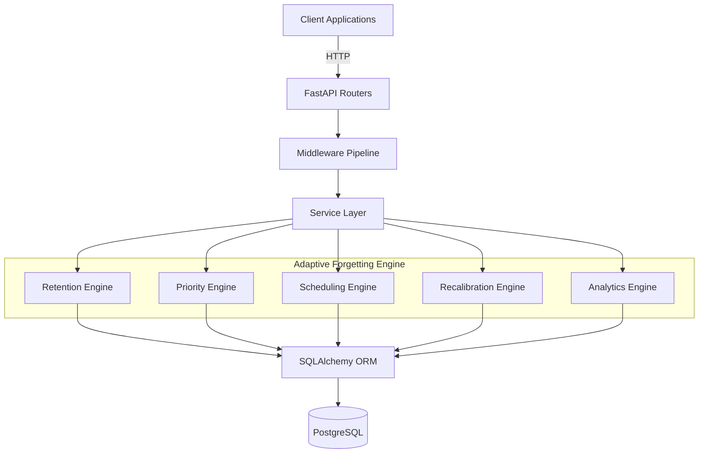

# Architecture

## System Overview and Design Philosophy
The KnowDecay Engine is built on an **API-first** philosophy, providing Retention Intelligence as a Service (RIaaS). It uses a clean **service-layer architecture** to separate HTTP concerns from core business logic, enabling testability, maintainability, and scalability.

## Request Lifecycle
1. **Client** initiates an HTTP request.
2. **FastAPI** receives the request.
3. **Middleware Pipeline**: The request passes through the middleware stack.
4. **Router**: FastAPI routes the request to the appropriate endpoint handler.
5. **Service**: The handler delegates business logic to a dedicated service function (handling transactions).
6. **Engine**: Services orchestrate calls to the appropriate sub-engines.
7. **ORM**: SQLAlchemy performs database operations.
8. **PostgreSQL**: Data is persisted or retrieved.

## Middleware Pipeline
The middleware pipeline executes in the following order (last added = first executed):
1. **RequestIdMiddleware**: Assigns a unique correlation ID to the request for tracing.
2. **LoggingMiddleware**: Logs structured request and response details.
3. **ErrorMiddleware**: Acts as a last-resort catch-all for unhandled exceptions.

## Service Layer Pattern
API handlers in the routing layer remain thin, delegating complex operations to service functions. The service layer is responsible for database transactions, ensuring atomicity and isolating the core engines from HTTP mechanics.

## Adaptive Forgetting Engine Architecture
The core intelligence is distributed across 5 specialized sub-engines:
- **Retention Engine**: Calculates and updates recall probabilities.
- **Priority Engine**: Ranks topics based on urgency and upcoming exams.
- **Scheduling Engine**: Determines the optimal intervals and timestamps for next revisions.
- **Recalibration Engine**: Adjusts memory states dynamically based on new learning events (quizzes, study sessions).
- **Analytics Engine**: Aggregates retention metrics upward through the knowledge hierarchy.

## Knowledge Hierarchy
The system maps educational content using a strict 5-level hierarchy:
`Subject → Module → Chapter → Topic → Subtopic`
All core retention tracking (memory states, study sessions, quizzes) occurs at the **Topic** level.

## Central Data Structure: MemoryState
The `MemoryState` model is the central nervous system of KnowDecay. It maintains one continuous row per `user × topic` pair. Instead of recalculating retention from scratch on every read, the recalibration engine continuously updates this state row.

## Authentication Architecture
- **Access Tokens**: Stateless JWTs using HS256, valid for 30 minutes.
- **Refresh Tokens**: Statefully tracked via DB-stored SHA-256 hashes, valid for 7 days, and rotated upon use.

## Authorization
A 5-tier Role-Based Access Control (RBAC) model dictates permissions hierarchically:
`super_admin > institution_admin > teacher > student > api_client`

## Current Infrastructure
- **Containerization**: Docker multi-stage builds.
- **Application Server**: Gunicorn orchestrating Uvicorn ASGI workers running FastAPI.
- **CI/CD**: GitHub Actions for continuous integration.

## Architecture Layers Diagram

## 🔮 Future Architecture
- **Learning Analytics**: Advanced data warehousing for long-term trends.
- **ML/MLOps**: Machine learning augmentation for decay modification.
- **Multi-tenancy**: Full isolation for institutions.
- **Enterprise integrations**: LTI and LMS hooks.
- **Redis**: Caching layer for high-throughput reads.
- **Background workers**: Celery/RQ for asynchronous processing.
- **Object storage**: S3-compatible storage for assets.
