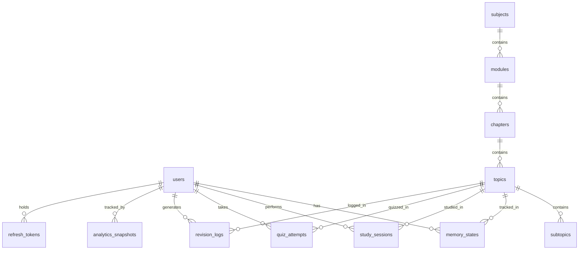

# Database Documentation

## Schema Overview
The KnowDecay Engine schema consists of 12 tables optimized for PostgreSQL. It supports complex retention calculations while preparing for multi-tenant deployments.

- **Tables**: `users`, `subjects`, `modules`, `chapters`, `topics`, `subtopics`, `study_sessions`, `quiz_attempts`, `revision_logs`, `memory_states`, `analytics_snapshots`, `refresh_tokens`.

## Entity-Relationship Diagram

## Tables Reference

### users
- **Purpose**: Core user identity.
- **Columns**: `id` (UUID, PK), `name` (String), `email` (String, Unique, Index), `institution_id` (String, Nullable, Index), `created_at` (DateTime), `password_hash` (String, Nullable), `role` (String, Index), `is_active` (Boolean), `updated_at` (DateTime).

### subjects
- **Purpose**: Top-level knowledge grouping.
- **Columns**: `id` (UUID, PK), `name` (String), `institution_id` (String, Nullable, Index), `created_at` (DateTime).

### modules
- **Purpose**: Second-tier hierarchy.
- **Columns**: `id` (UUID, PK), `subject_id` (UUID, FK: subjects.id), `name` (String), `created_at` (DateTime).

### chapters
- **Purpose**: Third-tier hierarchy.
- **Columns**: `id` (UUID, PK), `module_id` (UUID, FK: modules.id), `name` (String), `created_at` (DateTime).

### topics
- **Purpose**: The atomic unit of retention tracking.
- **Columns**: `id` (UUID, PK), `chapter_id` (UUID, FK: chapters.id), `name` (String), `difficulty` (Float), `importance_weight` (Float), `created_at` (DateTime).

### subtopics
- **Purpose**: Deepest hierarchy level (informational).
- **Columns**: `id` (UUID, PK), `topic_id` (UUID, FK: topics.id), `name` (String), `created_at` (DateTime).

### study_sessions
- **Purpose**: Records time-based learning events.
- **Columns**: `id` (UUID, PK), `user_id` (UUID, FK: users.id), `topic_id` (UUID, FK: topics.id), `duration_minutes` (Integer), `created_at` (DateTime, Index).
- **Indexes**: Composite on `user_id`, `topic_id`, `created_at`.

### quiz_attempts
- **Purpose**: High-signal retention events.
- **Columns**: `id` (UUID, PK), `user_id` (UUID, FK: users.id), `topic_id` (UUID, FK: topics.id), `score` (Float), `confidence` (Float), `attempted_at` (DateTime, Index).
- **Indexes**: Composite on `user_id`, `topic_id`, `attempted_at`.

### revision_logs
- **Purpose**: Historical audit trail of retention updates.
- **Columns**: `id` (UUID, PK), `user_id` (UUID, FK: users.id), `topic_id` (UUID, FK: topics.id), `event_type` (String, Index), `retention_before` (Float), `retention_after` (Float), `stability_before` (Float), `stability_after` (Float), `score` (Float, Nullable), `confidence` (Float, Nullable), `revision_number` (Integer), `interval_days` (Float, Nullable), `revised_at` (DateTime, Index).
- **Indexes**: Composite on `user_id`, `topic_id`, `revised_at`.

### memory_states
- **Purpose**: The current snapshot of a user's retention for a topic.
- **Columns**: `id` (UUID, PK), `user_id` (UUID, FK: users.id), `topic_id` (UUID, FK: topics.id), `retention_score` (Float), `stability_score` (Float), `decay_rate` (Float), `confidence_score` (Float), `revision_strength` (Float), `revision_count` (Integer), `forgetting_probability` (Float), `urgency_score` (Float), `base_stability` (Float), `revision_quality` (Float), `difficulty_factor` (Float), `performance_trend` (Float), `adaptive_stability` (Float), `stability_growth_rate` (Float), `half_life_days` (Float), `effective_decay_rate` (Float), `time_to_critical` (Float), `days_until_target` (Float), `quality_variance` (Float), `effective_revision_count` (Integer), `revision_effectiveness_ratio` (Float), `time_pattern_regularity` (Float), `confidence_calibration_error` (Float), `peak_retention` (Float), `retention_at_last_revision` (Float), `total_forgetting_events` (Integer), `last_forgetting_event_at` (DateTime, Nullable), `last_revision_at` (DateTime, Nullable), `next_revision_at` (DateTime, Nullable), `updated_at` (DateTime).
- **Constraints**: `UNIQUE(user_id, topic_id)` named `uq_memory_state_user_topic`.
- **Indexes**: Composite indexes for `urgency_score`, `next_revision_at`, `retention_score`, `adaptive_stability` by `user_id`.

### analytics_snapshots
- **Purpose**: Pre-computed hierarchical rollups.
- **Columns**: `id` (UUID, PK), `user_id` (UUID, FK: users.id), `level` (String, Index), `ref_id` (UUID, Index), `retention_avg` (Float), `stability_avg` (Float), `topics_total` (Integer), `topics_at_risk` (Integer), `weakest_topics` (JSONB, Nullable), `retention_distribution` (JSONB, Nullable), `computed_at` (DateTime).

### refresh_tokens
- **Purpose**: Stateful refresh token tracking.
- **Columns**: `id` (UUID, PK), `user_id` (UUID, FK: users.id), `token_hash` (String, Unique, Index), `expires_at` (DateTime), `revoked` (Boolean), `created_at` (DateTime).

## Advanced Constraints & Strategies
- **Cascade Rules**: All entity relationships originating from `users` (e.g., `memory_states`, `study_sessions`) utilize `ON DELETE CASCADE`.
- **Multi-Tenant Readiness**: `institution_id` on `users` and `subjects` is fully indexed and ready for tenant-scoped querying.
- **Email Uniqueness**: Enforced uniquely on `users.email`.

## Migrations
- Managed via a dedicated Alembic migration service (never auto-migrated in production).
- **Migration History**:
  1. `0001_initial_schema`
  2. `0002_add_adaptive_forgetting_fields`
  3. `0003_add_retention_evolution_fields`
  4. `0004_add_auth_fields`
  5. `0005_add_revision_log_composite_index`

## 📌 Planned Additions
- Future schema extensions to support ML feature stores and institutional multi-tenancy mappings.
